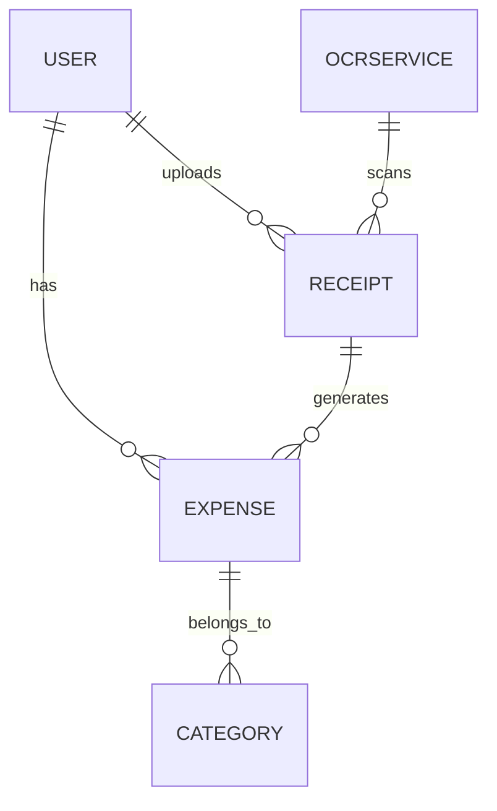
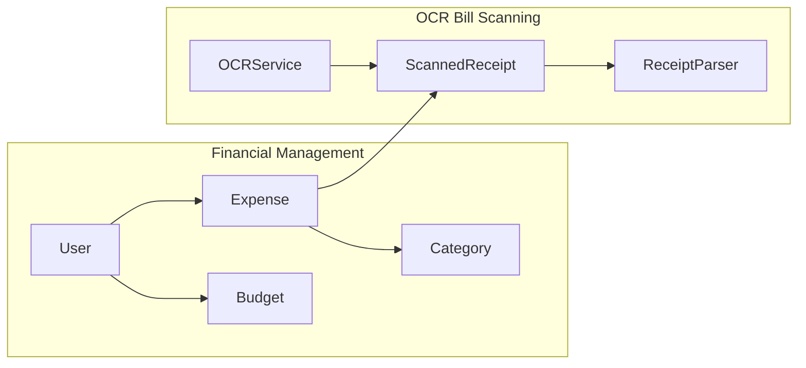

# WalletWiz

## Setup
1. Clone the repository
2. Run `yarn` to install dependencies
3. Start development
   - Run `yarn android` to start the app on Android
4. Link with Expo project: 
	- `yarn eas init --id 756e67df-1562-4452-be7f-e9cdf1306bfb`
5. Run `yarn lint` to lint the code
	- [Biomejs](https://biomejs.com) is used for linting
	- Using VSCode? Install the Biomejs extension for better linting experience

## Architecture

### Domain Driven Design

#### Boundary Context
