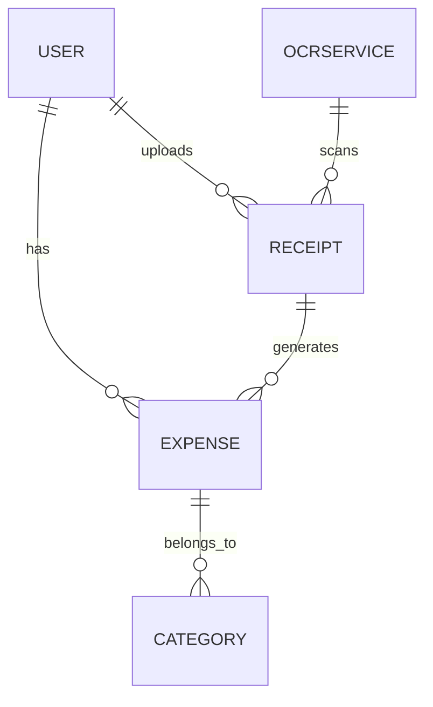
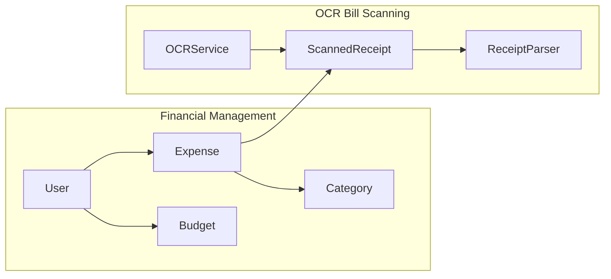

# WalletWiz

## Mobile App Development Setup
1. Clone the repository
2. Run `yarn` to install dependencies
3. Start development
   - Run `yarn android` to start the app on Android
4. Run `yarn lint` to lint the code
	- [Biomejs](https://biomejs.com) is used for linting
	- Using VSCode? Install the Biomejs extension for better linting experience

## API Development Setup
1.. Navigate to the `backend/api` directory
2. Run `npm i` to install dependencies
3. Run `npm run start:dev` to start the server

### Common commands

1. `yarn android` - Start the app on Android
2. `yarn eas build` - Build the app for production
3. `yarn eas update --channel preview` - Update the app for preview

## Architecture

### Tech Stack
- React Native: Frontend
- TypeScript: Language
- Expo: Development Environment
- Expo Router: Navigation
- Biomejs: Linting
- NestJS: Backend
- Google Cloud Functions + Google Gemini: OCR
- Github OAuth: Authentication

### Domain Driven Design

### Boundary Context

## Commit Convention
- Basic syntax: `WWIZ-<issue number> <type>(<subject>): <message>`
- Example: `WWIZ-1 feat(backend): Add user authentication`
- Types:
  - `feat`: New feature
  - `fix`: Bug fix
  - `docs`: Documentation
  - `style`: Formatting
  - `refactor`: Code change that doesn't affect the behavior
  - `test`: Adding missing tests
  - `chore`: Maintenance

